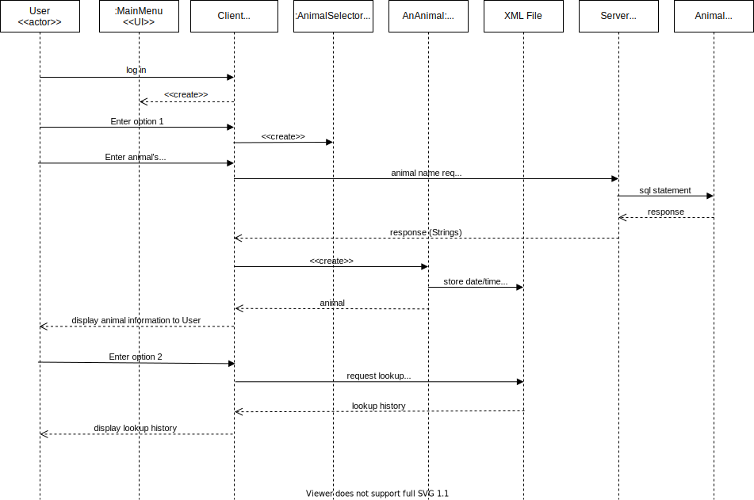

# Java 2 Final Project Fall 2020

Created UML Diagrams including Use Case Diagram, Sequence Diagram, and Class Diagram.
Created database.
Created client-server architecture
Used lambda expressions
Created XML files
Used Generics, Hashmaps, and Collections

write about the project; what you liked the most;
what did you struggle with and you weren't successful, how did you become successful

UML Diagrams provide a visual representation of a process.  Diagrams are tools that
allow the designer to think through the process more clearly and identify any gaps
in understanding.  They allow designers to communicate with users to make sure there
is a common understanding, before doing a lot of work.
While UML can be very detailed and in-depth, it can be used at a high level to
provide a description of the main functionality of the system.

## UML Diagrams

### Use Case Diagram

### Sequence Diagram

### Class Diagram

