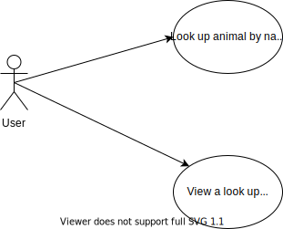

# Java 2 Final Project Fall 2020

write about the project; what you liked the most;
what did you struggle with and you weren't successful, how did you become successful

Diagrams provide a visual representation of a process.  Diagrams are tools that
allow the designer to think through the process more clearly and identify any gaps
in understanding.  They allow designers to communicate with users to make sure there
is a common understanding, before doing a lot of work.
While UML can be very 

## UML Diagrams

### Use Case Diagram

### Sequence Diagram

### Class Diagram

